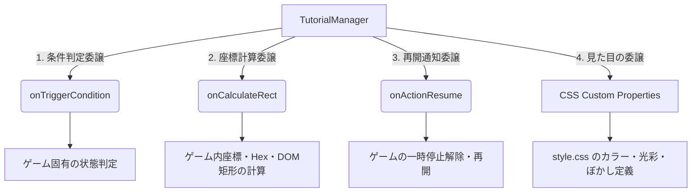

# 06. チュートリアルシステム仕様書

## 1. 概要
本仕様書は、`GameWorks OAK` アプリケーション向けに汎用的かつポータブルなインタラクティブガイドを提供する「チュートリアルシステム」の技術仕様を定義します。

本システムは、ゲーム固有のロジックや具体的なUIデザイン（ネオン、ぼかし等）から完全に独立した汎用エンジンとして設計されており、CSSカスタムプロパティおよび委譲ハンドラを介してあらゆるゲームにシームレスに統合できます。

---

## 2. 汎用アーキテクチャ

`TutorialManager` は以下の概念に基づき、ゲーム依存性を 100% 排除して設計されています。



### 2.1 コンストラクタ定義
```javascript
import { TutorialManager } from './tutorialManager.js';

const manager = new TutorialManager(scenariosJson, {
    onTriggerCondition: (triggerName, context) => boolean,
    onCalculateRect: (highlightData) => { top, left, width, height } | null,
    onActionResume: () => void
});
```

- **`onTriggerCondition(triggerName, context)`**:
  ゲーム側の特定の状態が、チュートリアルを開始すべき条件を満たしているかを判定して `boolean` を返します。
- **`onCalculateRect(highlightData)`**:
  ハイライト対象がゲーム内オブジェクト（例：六角形グリッド等）の場合に、その画面上の絶対座標矩形を計算して返します。
- **`onActionResume()`**:
  チュートリアルステップの完了時に、ゲーム側へアクションの一時停止（保留アクション）を解除・再開するよう通知します。

---

## 3. スタイルとデザインのCSS完全分離仕様

本システムは Canvas 上でのハイライト描画にカラーや影・光彩の値を直接ハードコードせず、すべて**CSSカスタムプロパティ**（CSS Variables）から動的に読み込みます。

### 3.1 CSSカスタムプロパティ一覧
ゲーム側の CSS ファイルで以下のカスタムプロパティを設定することで、任意のデザイン（ネオン、ぼかし等）を着せ替えることができます。

| プロパティ名 | 説明 | デフォルト値 |
| :--- | :--- | :--- |
| `--tutorial-mask-color` | 画面全体を覆う半透明暗幕の塗りつぶし色 | `rgba(0, 0, 0, 0.6)` |
| `--tutorial-highlight-stroke` | くり抜かれたハイライト領域の境界輪郭線の色 | `transparent` |
| `--tutorial-highlight-shadow` | くり抜かれた輪郭線の影・光彩（グロー）効果の色 | `transparent` |
| `--tutorial-highlight-shadow-blur` | 影・光彩効果のぼかし半径（ピクセル値） | `0` |

---

## 4. データ構造 (JSONシナリオ仕様)

チュートリアルシナリオデータは、ページ送りおよび複数ハイライトを考慮した以下の JSON 構造に従います。

```json
[
  {
    "stepIndex": 0,
    "trigger": "turnStart",
    "title": "Step Title",
    "pages": [
      {
        "pageIndex": 0,
        "message": "チュートリアルメッセージテキスト。",
        "highlight": [
          {
            "targetType": "map-all"
          }
        ]
      },
      {
        "pageIndex": 1,
        "message": "次のページのメッセージ。",
        "highlight": [
          {
            "targetType": "tapped-hex-area"
          },
          {
            "targetType": "p1-hand"
          }
        ]
      }
    ]
  }
]
```

### 4.1 ハイライト種別 (`highlight`)
- **`elementId` が存在する場合**:
  共通エンジンが自動的に `document.getElementById(elementId).getBoundingClientRect()` を用いて汎用的に画面絶対座標を計算します。
- **`targetType` のみが存在する場合**:
  `onCalculateRect(hl)` ハンドラに座標計算を委譲します。

---

## 5. UIおよびポジショニング制御

### 5.1 暗幕ぼかしマスク描画 (`updateMask`)
- Canvas 要素（`#tutorial-mask-canvas`）を画面一杯にリサイズし、`--tutorial-mask-color` で塗りつぶします。
- 合成モード `ctx.globalCompositeOperation = 'destination-out'` を用いて、指定されたすべてのハイライト領域をくり抜きます。
- ハイライト領域は、定義された **`padding`**（未指定時の基本デフォルトは `options.defaultPadding` または `0px`）に基づいて矩形または楕円の外側に完全に一貫した余白を保持して拡張されます。
  - **`shape: "rect"`**: `padding` ピクセルぶんだけ上下左右に拡大された角丸矩形で美しくくり抜かれます。
  - **その他（`circle` / `ellipse` 等）**: 縦横の半径それぞれに `padding` ピクセルを加算し、アスペクト比を完璧に維持したまま均等な外側余白をまとったグラデーション楕円でくり抜かれます。
- 合成モードを `source-over` に戻し、`--tutorial-highlight-stroke` および `--tutorial-highlight-shadow` に従い、拡張された正確な境界線に美しい光彩ストロークを完全に同期して描画します。

### 5.2 吹き出し（ツールチップ）の動的吸着とインテリジェント配置
- ツールチップ（`#tutorial-tooltip`）は、`highlight` 配列の**「先頭（最初の要素）」**の絶対座標に完璧に追従・吸着します。
- **「ぴったり吸着（0pxマージン）」**: 矩形であれ楕円であれ、実際に描画されている **`padding` で拡張された物理的なハイライト境界線（上端または下端）に、吹き出しの矢印先端が 0px の隙間もなくピタリと接触して一体化する美しいUI表現** を行います。
- **「空き余白に基づく動的上下配置決定」**: ハイライト枠の上部と下部にある画面（Viewport）の空き余白領域をリアルタイムに計測・比較し、**より広い余白がある側へ吹き出しを自動的かつスマートに配置**します。
  - 上側が広い場合：ハイライトの上端境界（`borderTop`）の上に配置され、下向きの矢印（`arrow-down`）が表示されます。
  - 下側が広い場合：ハイライトの下端境界（`borderBottom`）の下に配置され、上向きの矢印（`arrow-up`）が表示されます。
- 画面外へのはみ出しを防止するため、X軸方向に対する自動的な画面端マージン補正も同時に行われます。

---

## 6. ゲーム連携・タイミング完全移送とフリーズ制御（Burst Cascade での実装例）

### 6.1 タイミング完全移送による連続誤爆の物理的排除
従来の毎フレーム評価ループによる二重チェックや、チュートリアルダイアログを閉じた直後に同じ種類のチュートリアルが連続して誤爆表示されるバグを根絶するため、**すべてのトリガーの判定タイミングは「そのイベントが物理的に発生・完了した交代のその一瞬（1回限り）」に完全に移送**されています。

| トリガー名 | 物理的な移送先タイミング (1回限り) | 効果 |
| :--- | :--- | :--- |
| `turnStart` | 1) 通常の手番交代が発生した瞬間<br>2) コイントス演出が完了して先攻が確定した瞬間 | 手番が決定したその1フレームのみ実行されるため、ターン中に turnStart ステップが複数あっても誤爆しません。 |
| `afterInject` | 落下したエネルギー球体がすべて地面に着弾し、イージング（隆起）アニメーションが美しく静止してフェーズが完了した瞬間 | 隆起完了後の極上の静止盤面でフリーズし、通常プレイ時のノンストップ爽快感とチュートリアル時の美しさが完全同期。 |
| `burst` | 実際にオーバーフローしたセルが存在し、爆発アニメーション（`triggerBurst`）をキックする直前の瞬間 | 実際に爆発が起きるその直前の1フレームのみ評価され、再開時は判定を安全にバイパスしてスムーズに爆発へ移行。 |

### 6.2 描画フリーズ
`TutorialManager.isShowing === true` の間、ゲーム側の `requestAnimationFrame` アニメーションループ内での状態更新（`update`）をスキップし、静的な状態の `render()` および `tutorialManager.updateMask()` のみを実行して完全な静止を実現します。

### 6.3 誤入力ガード
ツールチップ表示中は、プレイヤーからのマウスクリックやタッチ操作イベントの入り口（`InputHandler.handleClick`）でガード条件を適用し、誤操作によるバグを 100% 防止します。

### 6.4 保留アクションによる同期競合防止
- トリガー発動時、ゲーム側で本来実行するはずだった処理を `game.pendingAction = () => { ... }` クロージャとして保存し、処理を早期リターン（保留）させます。
- プレイヤーが「OK」ボタンを押してチュートリアルを読み終えた際、登録された `onActionResume` を通じて `game.pendingAction` が実行され、ゲームが安全に再開されます。
